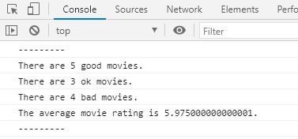

# Movie Score Looping

## Details

* Given a list of movie scores, I determined how many good, ok and bad movies there were.

* Created a for loop to go through the `movieScore` list.

* Added scores over 7 to the `goodMovies` array.

* Added scores between 5 and 7 to the `okMovies` array.

* Added the rest of the scores to the the `badMovies` array.

* Calculated the average rating for all of the movies.

* Printed out how many good, ok and bad movies there were and what the overall total score was
  to the console.
 
## How to Run Code

1. Clone repository to directory in computer

2. Open repository in source-code editor.

3. Navigate to index.html file

4. Right click in index.html file and click "open with live server"

5. Right click in browser web page and click "inspect"

6. Click on console

## Screenshots

 

The number of good, bad, and ok movies along with the average movie score are printed to the console.
